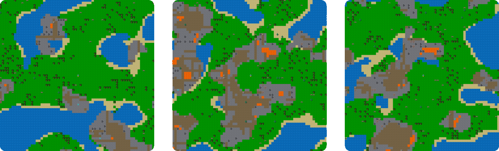

# Benchmarking Diverse Agent Capabilities

## Anonymous Website for Peer Review

<center>

</center>

### Play Yourself

```
python3 -m pip install crafter  # Install Crafter
python3 -m pip install pygame   # Needed for human interface
python3 -m crafter.run_gui      # Start the game
```

The key mapping will be printed to the terminal.

<video loop muted controls autoplay style="width: 30em">
<source src="video.mp4"/>
</video>

### Emergent Behaviors

The video shows behaviors of a DreamerV2 agent trained for 50M steps that
emerge from maximizing the provided reward signal.

<video controls style="width: 30em">
<source src="emergent.mp4"/>
</video>

### Source Code

The complete code for the environment, baseline agents, and figures in the
paper will be made available upon publication to ensure an anonymous review
period. We will also make the baseline scores available as JSON files.
